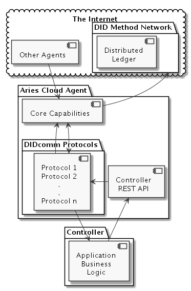

# Aries Cloud Agent Internals: Agent and Controller

This section talks in particular about the architecture of this Aries cloud agent implementation. An instance of an Aries agent is actually made up of to two parts - the agent itself and a controller. 

The agent handles all of the core Aries functionality such as interacting with other agents, managing secure storage, sending event notifications to, and receiving directions from, the controller. The controller provides the business logic that defines how that particular agent instance behaves--how to respond to events in the agent, and when to trigger the agent to initiate events. The controller might be a web or native user interface for a person or it might be coded business rules driven by an enterprise system.

Between the two is a simple interface. The agent sends event notifications to the controller and the controller sends administrator messages to the agent. The controller registers a webhook with the agent, and the event notifications are HTTP callbacks, and the agent exposes a REST API to the controller for all of the administrative messages it is configured to handle. Each of the DIDComm protocols supported by the agent adds a set of administrative messages for the controller to use in responding to events. The Aries cloud agent includes an [OpenAPI](https://swagger.io/tools/swagger-ui/) (aka Swagger) user interface for a developer to use to explore the API for a specific agent.

As such, the agent is just a configured dependency in an Aries cloud agent deployment. Thus, the vast majority of Aries developers will focus on building controllers (business logic) and perhaps some custom plugins (protocols, as we'll discuss soon) for the agent. Only a relatively small group of Aries cloud agent maintainers will focus on adding and maintaining the agent dependency.

Want more details about the agent and controller internals? Take a look at the [Aries cloud agent deployment model](../deploymentModel.md) document.

> Back to the [Aries Developer - Getting Started Guide](README.md).